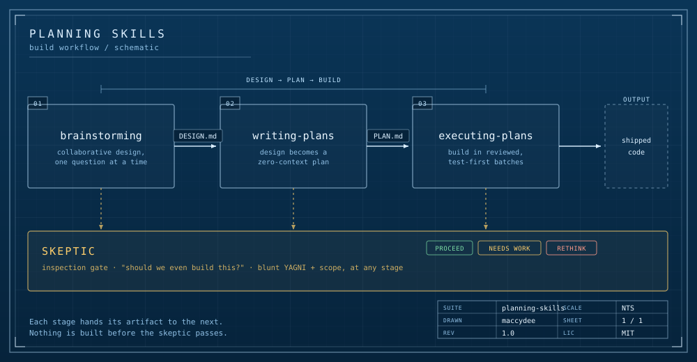

# Planning skills for Claude

Four skills that take a piece of work from a fuzzy idea to shipped code, with a reviewer that keeps asking whether you should be building it at all.



They're built for [Claude Code](https://docs.anthropic.com/en/docs/claude-code) and the skill system: Claude loads a skill when the task matches its description, then follows the instructions inside. These four are designed to hand off to each other, but each works on its own.

## The workflow

**`brainstorming`** settles the design before any code exists. It works one question at a time and always leads with a recommendation, so you're validating or redirecting a proposal rather than staring at a blank page. Out comes a `DESIGN.md` that captures the decisions and the trade-offs behind them.

**`writing-plans`** turns that design into an implementation plan a zero-context executor can follow: exact file paths, complete code, test-first cycles, and how to verify each step. The point is that whoever builds it (a fresh session, a teammate, you in a month) shouldn't have to guess. Out comes a `PLAN.md`.

**`executing-plans`** builds the plan in small batches with a review checkpoint after each one, so a wrong turn gets caught while it's cheap to fix instead of twenty tasks later. Every task is test-first and its output is checked for real, not just green.

**`skeptic`** is the reviewer. Its first question is never "is this built well?" but "should this exist at all?". Blunt YAGNI and scope critique, run at any stage: over a design, over a plan's scope, or over what got built before it merges. It ends on a verdict: PROCEED, NEEDS WORK, or RETHINK.

Each stage hands its artifact to the next. Nothing gets built before the skeptic has had a pass.

## Install

Claude Code discovers skills in `~/.claude/skills/`. Clone this repo and copy the four folders in:

```bash
git clone https://github.com/maccydee/claude-planning-skills.git
cd claude-planning-skills
cp -r brainstorming writing-plans executing-plans skeptic ~/.claude/skills/
```

They'll show up as available skills next time you start a session.

## Using them

You don't have to name a skill; Claude picks it up from what you ask. A few natural triggers:

- "brainstorm a design for X" or "help me think through the architecture" starts `brainstorming`.
- "write a plan for this" runs `writing-plans` (usually after a design exists).
- "execute the plan" or "start building from this plan" runs `executing-plans`.
- "be skeptical", "pressure-test this", or "should we even build this?" runs `skeptic`. It also takes a file: `/skeptic path/to/PLAN.md`.

A typical run is design in `brainstorming`, hand the `DESIGN.md` to `writing-plans`, hand the `PLAN.md` to `executing-plans`, and call in the `skeptic` at any point you feel scope creeping.

## Why they're shaped this way

The thread through all four is that guessing is where work goes wrong, so each skill removes a place to guess. `brainstorming` makes you defend a design before it's built. `writing-plans` writes down everything an executor would otherwise have to invent. `executing-plans` checks the output is real and stops on a genuine blocker instead of inventing past it. `skeptic` questions whether the thing is worth building in the first place, because the cheapest code to maintain is the code you never wrote.

## Licence

MIT. Use them, change them, share them.
